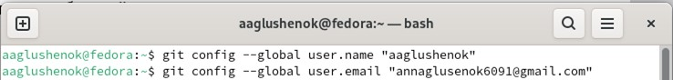

---
## Front matter
title: "Лабораторная работа №2"
subtitle: "Система контроля версий Git"
author: "Глушенок Анна Александровна"

## Generic otions
lang: ru-RU
toc-title: "Содержание"

## Bibliography
bibliography: bib/cite.bib
csl: pandoc/csl/gost-r-7-0-5-2008-numeric.csl

## Pdf output format
toc: true # Table of contents
toc-depth: 2
lof: true # List of figures
lot: true # List of tables
fontsize: 12pt
linestretch: 1.5
papersize: a4
documentclass: scrreprt
## I18n polyglossia
polyglossia-lang:
  name: russian
  options:
	- spelling=modern
	- babelshorthands=true
polyglossia-otherlangs:
  name: english
## I18n babel
babel-lang: russian
babel-otherlangs: english
## Fonts
mainfont: IBM Plex Serif
romanfont: IBM Plex Serif
sansfont: IBM Plex Sans
monofont: IBM Plex Mono
mathfont: STIX Two Math
mainfontoptions: Ligatures=Common,Ligatures=TeX,Scale=0.94
romanfontoptions: Ligatures=Common,Ligatures=TeX,Scale=0.94
sansfontoptions: Ligatures=Common,Ligatures=TeX,Scale=MatchLowercase,Scale=0.94
monofontoptions: Scale=MatchLowercase,Scale=0.94,FakeStretch=0.9
mathfontoptions:
## Biblatex
biblatex: true
biblio-style: "gost-numeric"
biblatexoptions:
  - parentracker=true
  - backend=biber
  - hyperref=auto
  - language=auto
  - autolang=other*
  - citestyle=gost-numeric
## Pandoc-crossref LaTeX customization
figureTitle: "Рис."
tableTitle: "Таблица"
listingTitle: "Листинг"
lofTitle: "Список иллюстраций"
lotTitle: "Список таблиц"
lolTitle: "Листинги"
## Misc options
indent: true
header-includes:
  - \usepackage{indentfirst}
  - \usepackage{float} # keep figures where there are in the text
  - \floatplacement{figure}{H} # keep figures where there are in the text
---

# Цель работы

Целью работы является изучить идеологию и применение средств контроля версий.
Приобрести практические навыки по работе с системой git.

# Задание 1. Базовая настройка git

## 
Откройте терминал и введите следующие команды, указав имя и email владельца репозитория.

Вводим команды «git config --global user.name ''<Name Surname>''» и «git config --global user.email ''<work@mail>''» с указанием собственных данных об имени и email-адресе.

{#fig:001 width=80%}

## 
Настройте utf-8 в выводе сообщений git. Задайте имя master начальной ветки.

Последовательно вводим команды «git config --global core.quotepath false» и «git config --global init.defaultBranch master» (с указанием имени начальной ветки master).

.png){#fig:002 width=80%}

## 
Задайте параметры autocrlf и safecrlf.

Последовательно вводим команды «git config --global core.autocrlf input» и «git config --global core.safecrlf warn» для задания указанных параметров.

.png){#fig:003 width=80%}

# Задание 2. Создание SSH ключа

## 
Сгенерируйте пару ключей (приватный и открытый).

Вводим команду «ssh-keygen -C ''Имя Фамилия <work@mail>''» с указанием собственных данных для генерации необходимой пары ключей.

.png){#fig:004 width=80%}

## 
Загрузите сгенеренный ключ на сайт github.

Вводим команду «cat ~/.ssh/id_rsa.pub | xclip –sel» для копирования ключа из локальной консоли в буфер обмена.

.png){#fig:005 width=80%}

Затем заходим на сайт github и вставляем сгенерированный нами ключ.

.png){#fig:006 width=80%}

.png){#fig:007 width=80%}

# Задание 3. Создание рабочего пространства и репозитория курса

## 
Откройте терминал и создайте каталог для предмета «Архитектура компьютера».

Для создание иерархической цепочки каталогов вводим следующую команду: mkdir -p ~/work/study/2023-2024/''Архитектура компьютера''.

.png){#fig:008 width=80%}

.png){#fig:009 width=80%}

# Задание 4. Создание репозитория курса

## 
Перейдите на станицу репозитория с шаблоном курса. В открывшемся окне задайте имя репозитория и создайте репозиторий.

Переходим на станицу репозитория с шаблоном курса. Задаем имя репозитория
«study_2024-2025_arh-pc» и нажимаем на «create repository».

.png){#fig:010 width=80%}

## 
Откройте терминал и перейдите в каталог курса. Клонируйте созданный репозиторий.

Используя	команду	«сd	~/work/study/2023–2024/"Архитектура	компьютера"» переходим в каталог курса.

.png){#fig:011 width=80%}

Затем с помощью команды «git clone --recursive git@github.com:<user_name>/study_2023–2024_arh-pc.git arch-pc» с указанием собственных данных осуществляем клонирование репозитория.

.png){#fig:012 width=80%}

# Задание 5. Настройка каталога курса

## 
Перейдите в каталог курса. Удалите лишние файлы, создайте необходимые каталоги.

Перемещаемся в каталог курса, используя команду «cd ~/work/study/2023- 2024/''Архитектура компьютера''/arch-pc». Удаляем лишние файлы и создаем необходимые каталоги, поочередно используя команды «rm package.json» и «echo arch-pc > COURSE make».

.png){#fig:013 width=80%}

## 
Отправьте файлы на сервер.

Для отправки файлов на сервер поочередно используем команды «git add .», «git commit -am 'feat(main): make course structure'» и «git push».

.png){#fig:014 width=80%}

# Вывод

В ходе выполнения работы поставленная цель была полностью выполнена: мне удалось изучить идеологию и применение средств контроля версий, приобрести практические навыки по работе с системой git.
