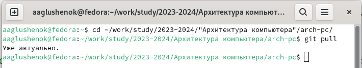
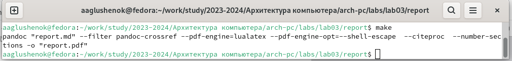
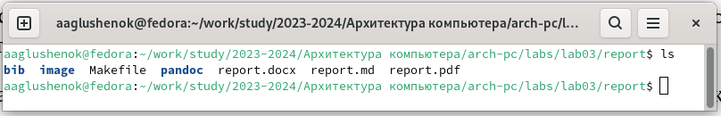
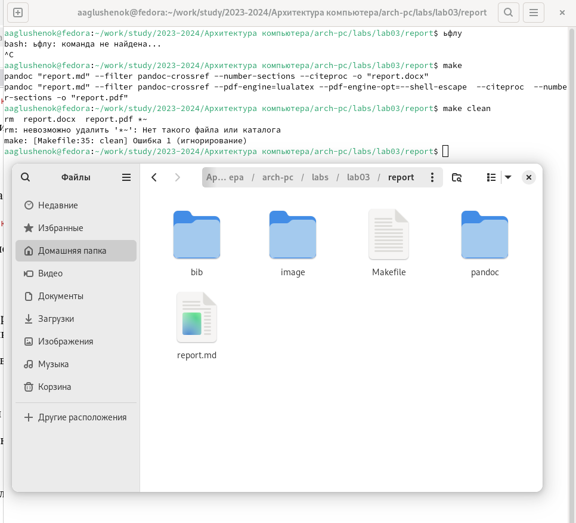
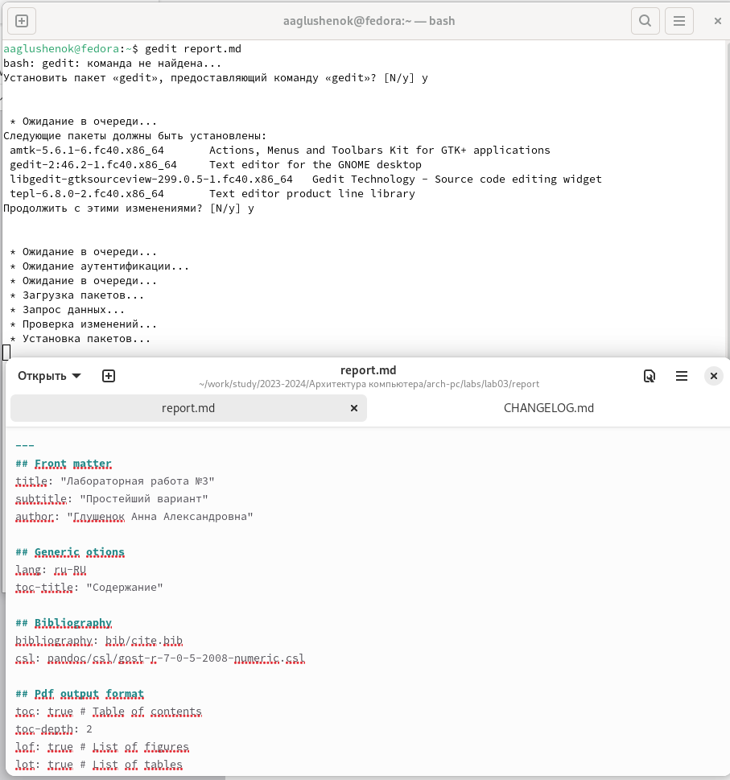

---
## Front matter
title: "Лабораторная работа №3"
subtitle: "Язык разметки Markdown"
author: "Глушенок Анна Александровна"

## Generic otions
lang: ru-RU
toc-title: "Содержание"

## Bibliography
bibliography: bib/cite.bib
csl: pandoc/csl/gost-r-7-0-5-2008-numeric.csl

## Pdf output format
toc: true # Table of contents
toc-depth: 2
lof: true # List of figures
lot: true # List of tables
fontsize: 12pt
linestretch: 1.5
papersize: a4
documentclass: scrreprt
## I18n polyglossia
polyglossia-lang:
  name: russian
  options:
	- spelling=modern
	- babelshorthands=true
polyglossia-otherlangs:
  name: english
## I18n babel
babel-lang: russian
babel-otherlangs: english
## Fonts
mainfont: IBM Plex Serif
romanfont: IBM Plex Serif
sansfont: IBM Plex Sans
monofont: IBM Plex Mono
mathfont: STIX Two Math
mainfontoptions: Ligatures=Common,Ligatures=TeX,Scale=0.94
romanfontoptions: Ligatures=Common,Ligatures=TeX,Scale=0.94
sansfontoptions: Ligatures=Common,Ligatures=TeX,Scale=MatchLowercase,Scale=0.94
monofontoptions: Scale=MatchLowercase,Scale=0.94,FakeStretch=0.9
mathfontoptions:
## Biblatex
biblatex: true
biblio-style: "gost-numeric"
biblatexoptions:
  - parentracker=true
  - backend=biber
  - hyperref=auto
  - language=auto
  - autolang=other*
  - citestyle=gost-numeric
## Pandoc-crossref LaTeX customization
figureTitle: "Рис."
tableTitle: "Таблица"
listingTitle: "Листинг"
lofTitle: "Список иллюстраций"
lotTitle: "Список таблиц"
lolTitle: "Листинги"
## Misc options
indent: true
header-includes:
  - \usepackage{indentfirst}
  - \usepackage{float} # keep figures where there are in the text
  - \floatplacement{figure}{H} # keep figures where there are in the text
---

# Цель работы

Целью работы является освоение процедуры оформления отчетов с помощью легковесного
языка разметки Markdown.

# Ход выполнения работы

## Задание 1. 
Откройте терминал, перейдите в каталог курса. Обновите локальный репозиторий, скачав изменения из удаленного репозитория.

Переходим  в каталог курса, вводя в терминал "cd ~/work/study/2023-2024/"Архитектура компьютера"/arch-pc/". После этого обновляем его, используя команду git pull.

{#fig:001 width=80%}

## Задание 2.
Перейдите в каталог с шаблоном отчета по лабораторной работе № 3. Проведите компиляцию шаблона с использованием Makefile. 

Переходим в нужный каталог, вводя в терминал "cd ~/work/study/2023-2024/"Архитектура компьютера"/arch-pc/labs/lab03/report". Затем проводим компиляцию шаблона отчета, используя команду make. После проделанных действий проверяем появление файлов report.pdf и report.doc.

{#fig:002 width=80%}

{#fig:003 width=80%}

## Задание 3.
Удалите полученный файлы с использованием Makefile. Проверьте, что файлы были удалены.

Удаляем файлы report.pdf и report.doc, используя команду make clean. Проверяем, что файлы удалены.

{#fig:004 width=80%}

## Задание 4.

(Выполняется перед внесением информации о выполнении предшествующих заданий). 
Откройте файл report.md c помощью любого текстового редактора. Внимательно изучите структуру этого файла.

С помощью текстового редактора gedit открываем файл report.md, вводя в терминал gedit report.md.

{#fig:005 width=80%}

# Вывод

В ходе выполнения лабораторной работы я смогла освоить процедуру оформления отчетов с помощью легковесного
языка разметки Markdown.

