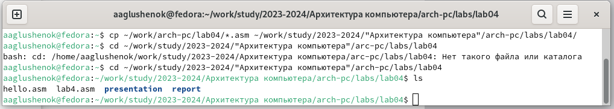

---
## Front matter
title: "Лабораторная работа №4"
author: "Глушенок Анна Александровна"

## Generic otions
lang: ru-RU
toc-title: "Содержание"

## Bibliography
bibliography: bib/cite.bib
csl: pandoc/csl/gost-r-7-0-5-2008-numeric.csl

## Pdf output format
toc: true # Table of contents
toc-depth: 2
lof: true # List of figures
lot: true # List of tables
fontsize: 12pt
linestretch: 1.5
papersize: a4
documentclass: scrreprt
## I18n polyglossia
polyglossia-lang:
  name: russian
  options:
	- spelling=modern
	- babelshorthands=true
polyglossia-otherlangs:
  name: english
## I18n babel
babel-lang: russian
babel-otherlangs: english
## Fonts
mainfont: IBM Plex Serif
romanfont: IBM Plex Serif
sansfont: IBM Plex Sans
monofont: IBM Plex Mono
mathfont: STIX Two Math
mainfontoptions: Ligatures=Common,Ligatures=TeX,Scale=0.94
romanfontoptions: Ligatures=Common,Ligatures=TeX,Scale=0.94
sansfontoptions: Ligatures=Common,Ligatures=TeX,Scale=MatchLowercase,Scale=0.94
monofontoptions: Scale=MatchLowercase,Scale=0.94,FakeStretch=0.9
mathfontoptions:
## Biblatex
biblatex: true
biblio-style: "gost-numeric"
biblatexoptions:
  - parentracker=true
  - backend=biber
  - hyperref=auto
  - language=auto
  - autolang=other*
  - citestyle=gost-numeric
## Pandoc-crossref LaTeX customization
figureTitle: "Рис."
tableTitle: "Таблица"
listingTitle: "Листинг"
lofTitle: "Список иллюстраций"
lotTitle: "Список таблиц"
lolTitle: "Листинги"
## Misc options
indent: true
header-includes:
  - \usepackage{indentfirst}
  - \usepackage{float} # keep figures where there are in the text
  - \floatplacement{figure}{H} # keep figures where there are in the text
---

# Цель работы

Освоение процедуры компиляции и сборки программ, написанных на ассемблере NASM.

# Ход выполнения работы 

## Задание 1. Программа Hello world!

Создайте каталог для работы с программами на языке ассемблера NASM. Перейдите в созданный каталог, Создайте текстовый файл с именем hello.asm.

С помощью команды mkdir создаем необходимый каталог, перемещаемся в него командой cd, и создаем текстовый файл с именем hello.asm, используя комнаду touch.

{#fig:001 width=80%}

Откройте этот файл с помощью любого текстового редактора, и введите в него необходимый текст.

Открываем файл в редакторе gedit, вводя "gedit hello.asm", затем вводим в него необходимый текст.

{#fig:002 width=80%}

## Задание 2. Транслятор NASM

Преобразуйте текст программы из файла hello.asm в объектный код, который запишется в файл hello.o. С помощью команды ls проверьте, что объектный файл был создан

Вводим в терминал "nasm -f elf hello.asm", затем командой ls проверяем, что необходимый файл создан.

{#fig:003 width=80%}

## Задание 3. Расширенный синтаксис командной строки NASM

Скомпилируйте исходный файл hello.asm в obj.o. С помощью команды ls проверьте, что файлы были созданы. Для более подробной информации см. "man nasm". Для получения списка форматов объектного файла см. "nasm -hf".

Для компилляции файла hello.asm в obj.o выполняем команду "nasm -o obj.o -f elf -g -l list.lst hello.asm". Вводим указанные команды, получаем более подробную информацию и список форматов объектного файла.

{#fig:004 width=80%}

{#fig:005 width=80%}

## Задание 4. Компоновщик LD
Получите исполняемую программу, передав объектный файл на обработку компоновщику. С помощью команды ls проверьте, что исполняемый файл hello был создан. Выполните следующую команду: ld -m elf_i386 obj.o -o main.

Вводим команды "ld -m elf_i368 obj.o -o main" и "ld -m elf_i386 obj.o -o main". Проверяем командой ls. 

{#fig:006 width=80%}

Формат командной строки LD можно увидеть, набрав ld --help. Для получения более подробной информации см. man ld.

Вводим указанные команды для просмотра формата командной строки ld и получения более подробной информации.

{#fig:007 width=80%}

## Задание 5. Запуск исполняемого файла

Запустите на выполнение созданный исполняемый файл, находящийся в текущем каталоге.

Для запуска исполняемого файла на выполнение переходим в нужный каталог и вводим "./hello"/

{#fig:008 width=80%}

## Задания для самостоятельной работы

В каталоге ~/work/arch-pc/lab04 с помощью команды cp создайте копию файла hello.asm с именем lab4.asm.

{#fig:009 width=80%}

С помощью любого текстового редактора внесите изменения в текст программы в файле lab4.asm так, чтобы вместо Hello world! на экран выводилась строка с вашими фамилией и именем. Оттранслируйте полученный текст программы lab4.asm в объектный файл. Выполните компоновку объектного файла и запустите получившийся исполняемый файл.

{#fig:010 width=80%}

{#fig:011 width=80%}

{#fig:012 width=80%}

Скопируйте файлы hello.asm и lab4.asm в Ваш локальный репозиторий в каталог ~/work/study/2023-2024/"Архитектура компьютера"/arch-pc/labs/lab04/. Загрузите файлы на Github.

{#fig:013 width=80%}

{#fig:014 width=80%}

# Вывод

В ходе выполнения лабораторной работы мне удалось освоить процедуры компиляции и сборки программ, написанных на ассемблере NASM.

