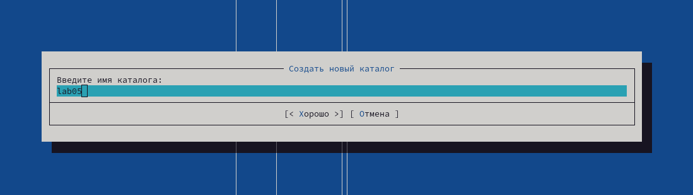
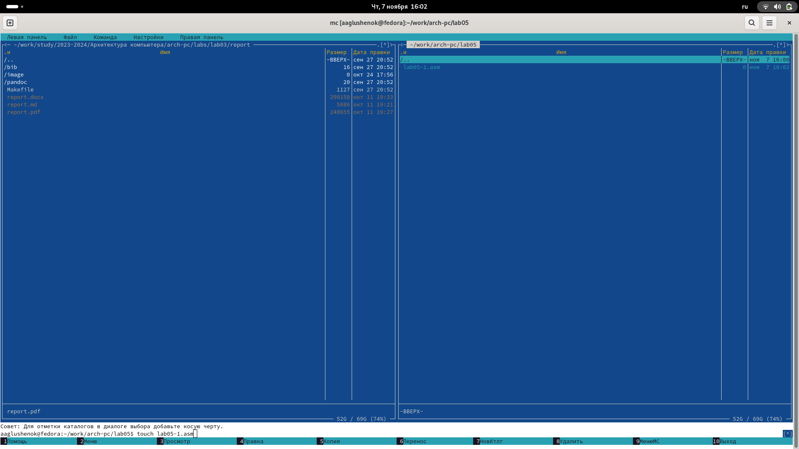
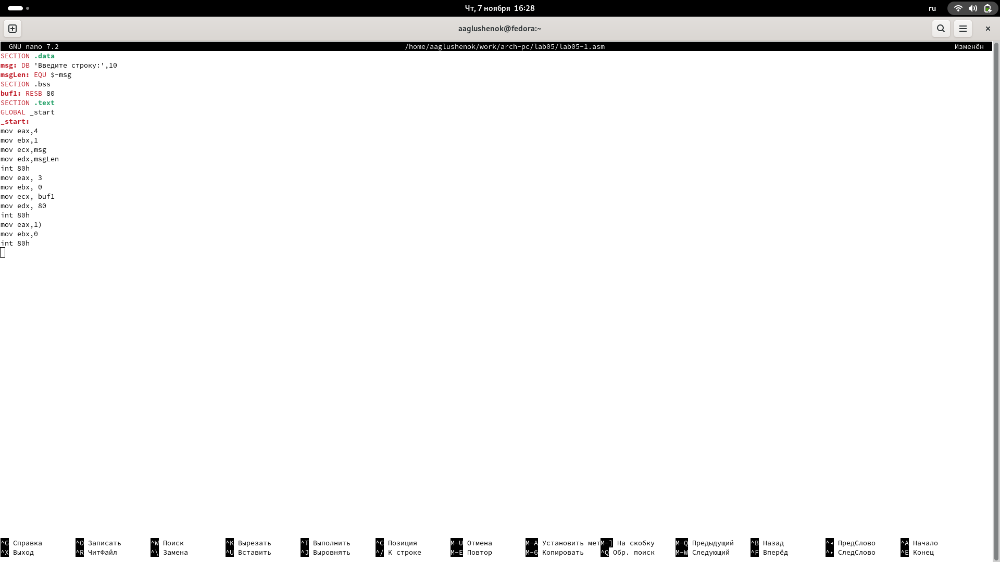
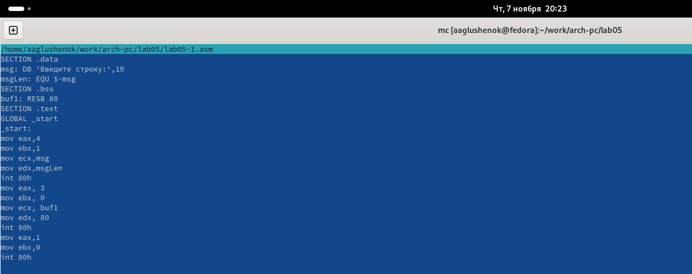
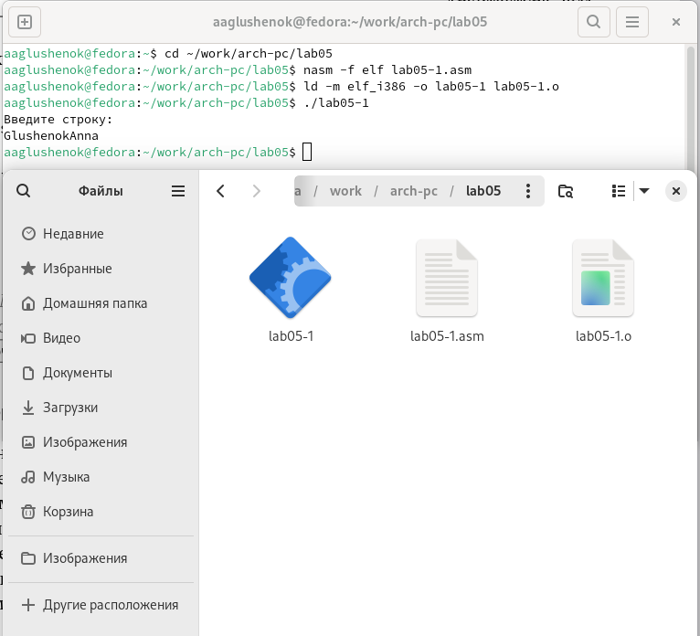
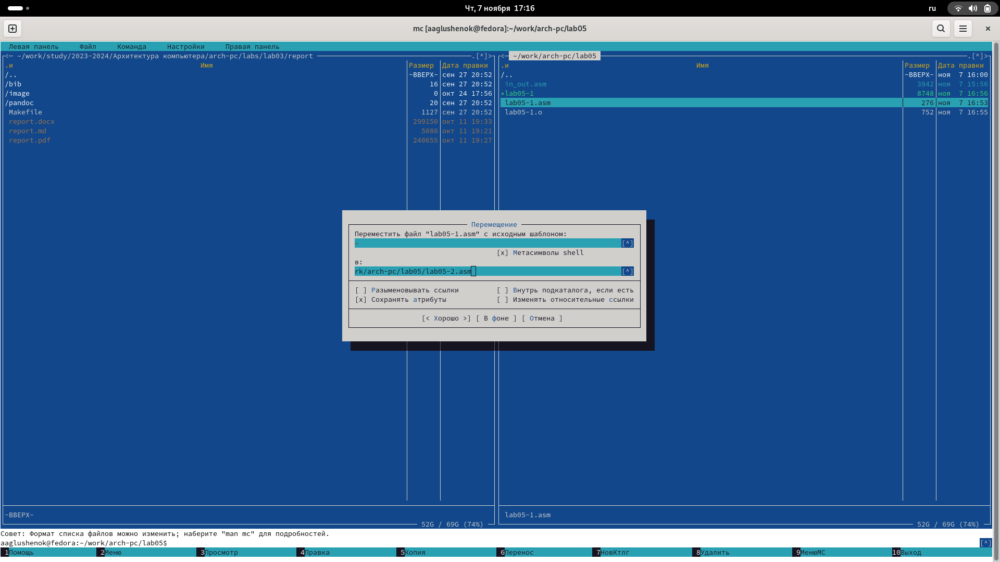
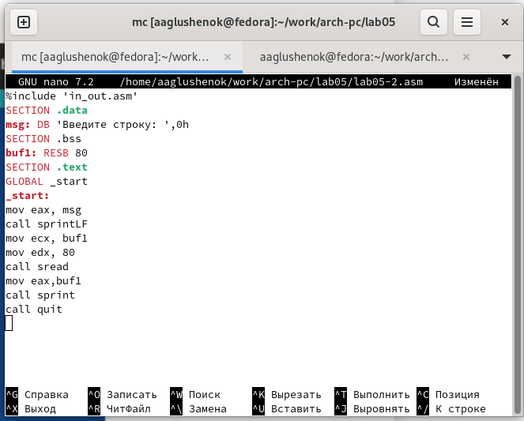

---
## Front matter
title: "Лабораторная работа №5"
author: "Глушенок Анна Александровна"

## Generic otions
lang: ru-RU
toc-title: "Содержание"

## Bibliography
bibliography: bib/cite.bib
csl: pandoc/csl/gost-r-7-0-5-2008-numeric.csl

## Pdf output format
toc: true # Table of contents
toc-depth: 2
lof: true # List of figures
lot: true # List of tables
fontsize: 12pt
linestretch: 1.5
papersize: a4
documentclass: scrreprt
## I18n polyglossia
polyglossia-lang:
  name: russian
  options:
	- spelling=modern
	- babelshorthands=true
polyglossia-otherlangs:
  name: english
## I18n babel
babel-lang: russian
babel-otherlangs: english
## Fonts
mainfont: IBM Plex Serif
romanfont: IBM Plex Serif
sansfont: IBM Plex Sans
monofont: IBM Plex Mono
mathfont: STIX Two Math
mainfontoptions: Ligatures=Common,Ligatures=TeX,Scale=0.94
romanfontoptions: Ligatures=Common,Ligatures=TeX,Scale=0.94
sansfontoptions: Ligatures=Common,Ligatures=TeX,Scale=MatchLowercase,Scale=0.94
monofontoptions: Scale=MatchLowercase,Scale=0.94,FakeStretch=0.9
mathfontoptions:
## Biblatex
biblatex: true
biblio-style: "gost-numeric"
biblatexoptions:
  - parentracker=true
  - backend=biber
  - hyperref=auto
  - language=auto
  - autolang=other*
  - citestyle=gost-numeric
## Pandoc-crossref LaTeX customization
figureTitle: "Рис."
tableTitle: "Таблица"
listingTitle: "Листинг"
lofTitle: "Список иллюстраций"
lotTitle: "Список таблиц"
lolTitle: "Листинги"
## Misc options
indent: true
header-includes:
  - \usepackage{indentfirst}
  - \usepackage{float} # keep figures where there are in the text
  - \floatplacement{figure}{H} # keep figures where there are in the text
---

# Цель работы

Приобретение практических навыков работы в Midnight Commander. Освоение инструкций
языка ассемблера mov и int.

# Ход выполнения работы

## Задание 1. Порядок выполнения лабораторной работы
Откройте Midnight Commander, перейдите в каталог ~/work/arch-pc, созданный при выполнении лабораторной работы №4, создайте папку lab05 и перейдите в созданный каталог.

Открываем Midnight Commander (mc), в указанном каталоге создаем папку lab05, нажимая на f7.

{#fig:001 width=80%}

Создайте файл lab5-1.asm, откройте его для редактирования во встроенном редакторе, введите текст программы вывода сообщения на экран и ввода строки с клавиатуры (листинг 5.1.).

С помощью команды touch создаем файл lab05-1.asm. Нажимая f4 открываем его во встроенном редакторе, и вводим необходимый текст. 

{#fig:002 width=80%}

{#fig:003 width=80%}

Откройте файл lab5-1.asm для просмотра. Убедитесь, что файл содержит текст программы. Оттранслируйте текст программы lab5-1.asm в объектный файл. Выполните компоновку объектного файла и запустите получившийся исполняемый файл. На запрос введите Ваши ФИО.

Нажимая f3 открываем файл lab05-1.asm для просмотра. Вводим в терминал необходимые команды для компоновки объектного файла и его запуска. После получения строки "Введите строку:", вводим ФИО.

{#fig:004 width=80%}

{#fig:005 width=80%}

## Задание 2. Подключение внешнего файла in_out.asm

Скачайте файл in_out.asm, создайте копию файла lab5-1.asm с именем lab5-2.asm. 

Скачиваем указанный файл. Нажимая f6, создаем копию файла lab05-1.asm с именем lab05-2.asm. 

{#fig:006 width=80%}

Исправьте текст программы в файле lab5-2.asm с использование подпрограмм из внешнего файла in_out.asm (используйте подпрограммы sprintLF, sread и quit). Создайте исполняемый файл и проверьте его работу.

Меняем текст в файле lab05-2.asm в соответствии с листингом 5.2. Создаем исполняемый файл, после получения строки "Введите строку:", вводим ФИО.

{#fig:007 width=80%}

В файле lab5-2.asm замените подпрограмму sprintLF на sprint. Создайте исполняемый файл и проверьте его работу. В чем разница?

В файле lab05-2.asm меняем sprintLF на sprint. Создаем исполняемый файл, после получения строки "Введите строку:", вводим ФИО.

{#fig:008 width=80%}

Таким образом, понимаем, что команда sprint дает возможность ввести текст в той же строке, а sprintLF переносит пользователя новую строку.

## Задания для самостоятельной работы

1. Создайте копию файла lab5-1.asm. Внесите изменения в программу (без использования внешнего файла in_out.asm), так чтобы она позволяла ввести строку с клавиатуры и выводила ее на экран. Получите исполняемый файл и проверьте его работу.

Копируем указанный файл, вносим в него необходимые изменения. Создаем исполняемый файл и убеждаемся в правильности его работы.

{#fig:009 width=80%}

{#fig:010 width=80%}

2. Создайте копию файла lab5-2.asm. Внесите изменения в программу с использованием подпрограмм внешнего файла in_out.asm, так чтобы она позволяла ввести строку с клавиатуры и выводила ее на экран. Получите исполняемый файл и проверьте его работу.

Копируем указанный файл, вносим в него необходимые изменения. Создаем исполняемый файл и убеждаемся в правильности его работы.

{#fig:011 width=80%}

{#fig:012 width=80%}

# Вывод

В ходе выполнения лабораторной работы мне удалось приобрести практические навыки работы в Midnight Commander и освоить инструкции языка ассемблера mov и int.

