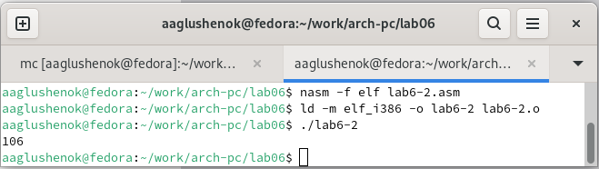

---
## Front matter
title: "Лабораторная работа №6"
subtitle: "Арифметические операции в NASM"
author: "Глушенок Анна"

## Generic otions
lang: ru-RU
toc-title: "Содержание"

## Bibliography
bibliography: bib/cite.bib
csl: pandoc/csl/gost-r-7-0-5-2008-numeric.csl

## Pdf output format
toc: true # Table of contents
toc-depth: 2
lof: true # List of figures
lot: true # List of tables
fontsize: 12pt
linestretch: 1.5
papersize: a4
documentclass: scrreprt
## I18n polyglossia
polyglossia-lang:
  name: russian
  options:
	- spelling=modern
	- babelshorthands=true
polyglossia-otherlangs:
  name: english
## I18n babel
babel-lang: russian
babel-otherlangs: english
## Fonts
mainfont: IBM Plex Serif
romanfont: IBM Plex Serif
sansfont: IBM Plex Sans
monofont: IBM Plex Mono
mathfont: STIX Two Math
mainfontoptions: Ligatures=Common,Ligatures=TeX,Scale=0.94
romanfontoptions: Ligatures=Common,Ligatures=TeX,Scale=0.94
sansfontoptions: Ligatures=Common,Ligatures=TeX,Scale=MatchLowercase,Scale=0.94
monofontoptions: Scale=MatchLowercase,Scale=0.94,FakeStretch=0.9
mathfontoptions:
## Biblatex
biblatex: true
biblio-style: "gost-numeric"
biblatexoptions:
  - parentracker=true
  - backend=biber
  - hyperref=auto
  - language=auto
  - autolang=other*
  - citestyle=gost-numeric
## Pandoc-crossref LaTeX customization
figureTitle: "Рис."
tableTitle: "Таблица"
listingTitle: "Листинг"
lofTitle: "Список иллюстраций"
lotTitle: "Список таблиц"
lolTitle: "Листинги"
## Misc options
indent: true
header-includes:
  - \usepackage{indentfirst}
  - \usepackage{float} # keep figures where there are in the text
  - \floatplacement{figure}{H} # keep figures where there are in the text
---

# Цель работы

Освоение арифметических инструкций языка ассемблера NASM.

# Ход выполнения работы

## Задание 1
1. Создайте каталог для программам лабораторной работы № 6, перейдите в него и создайте файл lab6-1.asm.

Создаем указанный каталог, используя команду mkdir, переходим в него и с помощью команды touch создаем нужный файл.

{#fig:001 width=80%}

2. Введите в файл lab6-1.asm текст программы из листинга 6.1. (Программа вывода значения регистра eax). Создайте исполняемый файл и запустите его.

Вводим текст листинга 6.1., создаем исполняемый файл, и в результате его работы получаем символ "j".

{#fig:002 width=80%}

{#fig:003 width=80%}

3. Внесите изменения в текст программы: вместо символов запишите в регистры числа. Создайте исполняемый файл и запустите его. Пользуясь таблицей ASCII определите какому символу соответствует код 10.

Вносим изменения в программу: убирая кавычки возле символов, превращаем их в числа. Создаем исполняемый файл, и в результате его работы получаем 2 пустых строки. Так происходит из-за того, что коду 10 в таблице ASCII соответствует символ переноса строки (сама строка остается пустой).

{#fig:004 width=80%}

{#fig:005 width=80%}

4. Преобразуйте текст программы из Листинга 6.1 с использованием функций преобразования символов в числа и обратно. Создайте файл lab6-2.asm и введите в него текст программы из листинга 6.2. Создайте исполняемый файл и запустите его.

В указанном каталоге с помощью команды touch создаем файл lab6-2.asm, вводим текст из листинга 6.2. (Программа вывода значения регистра eax). Создаем исполняемый файл и запускаем его. в результате работы программы выводится число 106, вывести которое позволяет функция iprintLF.

{#fig:006 width=80%}

{#fig:007 width=80%}

{#fig:008 width=80%}

5. Аналогично предыдущему примеру измените символы на числа. Создайте исполняемый файл и запустите его. Замените функцию iprintLF на iprint. Создайте исполняемый файл и запустите его. 

Заменяем символы на числа, убирая кавычки возле них. Создаем исполняемый файл, и в результате работы программы получаем число 10, то есть верный ответ на исходную задачу (4+6). В результате замены функции iprintLF на iprint мы так же получаем число 10, но уже переноса строки.

{#fig:009 width=80%}

{#fig:010 width=80%}

{#fig:011 width=80%}

## Задание 2

6. Создайте файл lab6-3.asm, введите в него текст из листинга 6.3. Создайте исполняемый файл и запустите его. Измените текст программы для вычисления выражения f(x) = (4*6+2)/5. Создайте исполняемый файл и проверьте его работу.

С помощью команды touch создаем указанный файл, вводим в него текст листинга 6.3.(Программа вычисления выражения f(x)=(5*2+3)/3). Создаем исполняемый файл, запускаем его. В результате работы программы получаем частное и остаток заданного выражения. Вносим изменения в программу, и в ответе, аналогично, получаем частное и остаток от второго выражения.

{#fig:012 width=80%}

{#fig:013 width=80%}

{#fig:014 width=80%}

{#fig:015 width=80%}

{#fig:016 width=80%}

7. Рассмотрите программу вычисления варианта задания по номеру студенческого билета (запрос номера билета, вычисление варианта по формуле, вывод номера варианта). Создайте файл variant.asm, введите в него текст листинга 6.4. Создайте исполняемый файл и запустите его. Проверьте результат работы программы вычислив номер варианта.

Для реализации данной программы создаем файл variant.asm и вводим в него текст листинга 6.2. (Программа вычисления варианта задания по номеру студенческого билета). Создаем исполняемый файл. В результате его работы получаем запрос на ввод номера студ билета, и после ввода номера получаем цифру, соответствующую варианту. Проверяем результат работы программы с помощью калькулятора.

{#fig:017 width=80%}

{#fig:018 width=80%}

{#fig:019 width=80%}

{#fig:020 width=80%}

## Ответы на вопросы

1. Какие строки листинга 6.4 отвечают за вывод на экран сообщения ‘Ваш вариант:’?
ОТВЕТ: За вывод на экран сообщения ‘Ваш вариант:’ отвечает строка “mov eax,rem” и строка “call sprint”.

2. Для чего используется следующие инструкции?
mov ecx, x
mov edx, 80
call sread
ОТВЕТ: Иструкции используются для чтения строки с вводом данных от пользователя. Начальный адрес строки сохраняется в регистре ecx, а максимальное количество считываемых символов строки в регистре edx. Затем вызывается процедура sread, которая выполняет чтение строки.

3. Для чего используется инструкция “call atoi”?
ОТВЕТ: Инструкция “call atoi” используется для преобразования строки в целое число.Она принимает адрес строки в регистре eax и возвращает полученное число в нем же.

4. Какие строки листинга 6.4 отвечают за вычисление варианта?
ОТВЕТ: Строка “xor edx,edx” обнуляет регистр edx перед выполнением деления. Строка “mov ebx,20” загружает значение 20 в регистр ebx. Строка “div ebx” выполняет деление регистра eax на значение регистра ebx с сохранением частного в регистре eax и остатка в регистре edx.

5. В какой регистр записывается остаток от деления при выполнении инструкции “div ebx”?
ОТВЕТ: Остаток от деления записывается в регистр edx.

6. Для чего используется инструкция “inc edx”?
ОТВЕТ: Инструкция “inc edx” используется для увеличения значения в регистре edx на 1. В данном случае, она увеличивает остаток от деления на 1

7. Какие строки листинга 6.4 отвечают за вывод на экран результата вычислений?
ОТВЕТ: Строка “mov eax,edx” передает значение остатка от деления в регистр eax. Строка “call iprintLF” вызывает процедуру iprintLF для вывода значения на экран вместе с переводом строки.

## Задания для самостоятельной работы

Написать программу вычисления выражения y = f(x), где f(x) = (9x − 8)/8 (вариант 5), проверить правильность работы программы для х=8 и х=64.

Аналогично предшествующим программам, создаем новую программу для вычисления значения функции. Затем создаем исполняемый файл. Программа запрашивает у пользователя ввести значение х, дает возможность ввода, после чего вычисляет и выводит значение функции при заданном пользователем значении х. 

{#fig:021 width=80%}

{#fig:022 width=80%}

# Выводы

В ходе выполнения лабораторной работы мне удалось освоить арифметические инструкции языка ассемблера NASM.
