---
## Front matter
title: "Лабораторная работа № 7"
subtitle: "Команды безусловного и условного переходов в Nasm. Программирование ветвлений"
author: "Глушенок Анна Александровна"

## Generic otions
lang: ru-RU
toc-title: "Содержание"

## Bibliography
bibliography: bib/cite.bib
csl: pandoc/csl/gost-r-7-0-5-2008-numeric.csl

## Pdf output format
toc: true # Table of contents
toc-depth: 2
lof: true # List of figures
lot: true # List of tables
fontsize: 12pt
linestretch: 1.5
papersize: a4
documentclass: scrreprt
## I18n polyglossia
polyglossia-lang:
  name: russian
  options:
	- spelling=modern
	- babelshorthands=true
polyglossia-otherlangs:
  name: english
## I18n babel
babel-lang: russian
babel-otherlangs: english
## Fonts
mainfont: IBM Plex Serif
romanfont: IBM Plex Serif
sansfont: IBM Plex Sans
monofont: IBM Plex Mono
mathfont: STIX Two Math
mainfontoptions: Ligatures=Common,Ligatures=TeX,Scale=0.94
romanfontoptions: Ligatures=Common,Ligatures=TeX,Scale=0.94
sansfontoptions: Ligatures=Common,Ligatures=TeX,Scale=MatchLowercase,Scale=0.94
monofontoptions: Scale=MatchLowercase,Scale=0.94,FakeStretch=0.9
mathfontoptions:
## Biblatex
biblatex: true
biblio-style: "gost-numeric"
biblatexoptions:
  - parentracker=true
  - backend=biber
  - hyperref=auto
  - language=auto
  - autolang=other*
  - citestyle=gost-numeric
## Pandoc-crossref LaTeX customization
figureTitle: "Рис."
tableTitle: "Таблица"
listingTitle: "Листинг"
lofTitle: "Список иллюстраций"
lotTitle: "Список таблиц"
lolTitle: "Листинги"
## Misc options
indent: true
header-includes:
  - \usepackage{indentfirst}
  - \usepackage{float} # keep figures where there are in the text
  - \floatplacement{figure}{H} # keep figures where there are in the text
---

# Цель работы

Изучение команд условного и безусловного переходов. Приобретение навыков написания программ с использованием переходов. Знакомство с назначением и структурой файла листинга.

# Выполнение лабораторной работы
## Задание 1. Реализация переходов в NASM

1. Создайте каталог для программам лабораторной работы № 7, перейдите в него и создайте файл lab7-1.asm.

Создаем указанный каталог, переходим в него и создаем внутри файл lab7-1.asm (команда mkdir).

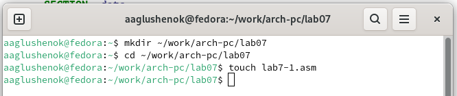{#fig:001 width=80%}

2. Рассмотрите пример программы с использованием инструкции jmp. Введите в файл lab7-1.asm текст программы из листинга 7.1. Создайте исполняемый файл и запустите его. 

Вводим в файл lab7-1.asm текст программы из листинга 7.1. (Программа с использованием инструкции jmp), создаем исполняемый файл и запускаем его. 

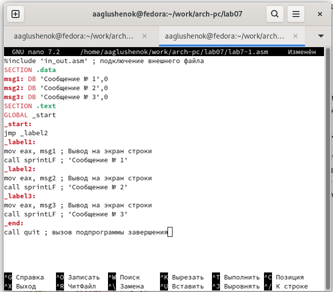{#fig:002 width=80%}

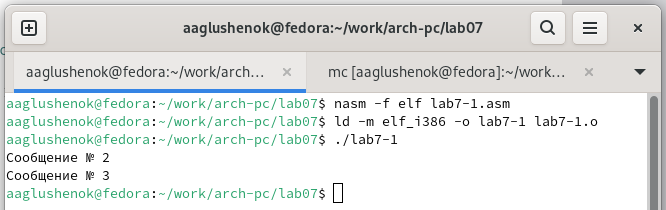{#fig:003 width=80%}

3. Измените программу таким образом, чтобы она выводила сначала "Сообщение № 2", потом "Сообщение № 1" и завершала работу. Создайте исполняемый файл и проверьте его работу.

Меняем программу в соответствии с листингом 7.2. (Программа с использованием инструкции jmp): в текст программы после вывода сообщения № 2 добавляем инструкцию jmp с меткой _label1, а после вывода сообщения № 1 добавляем инструкцию jmp с меткой _end. Создаем исполняемый файл и проверяем его работу.

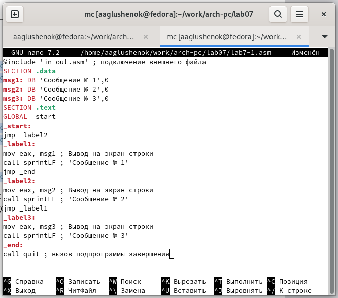{#fig:004 width=80%}

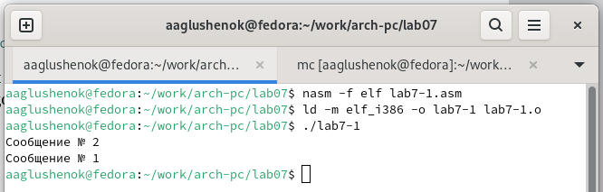{#fig:005 width=80%}

4. Измените текст программы, добавив или изменив инструкции jmp, чтобы программа выводила сначала "Сообщение № 3, потом "Сообщение № 2", "Сообщение № 1" и завершала работу.

Вносим изменения в программу, добавляем инструкции jmp и меняем их метки. Создаем исполняемый файл и проверяем результат работы программы.

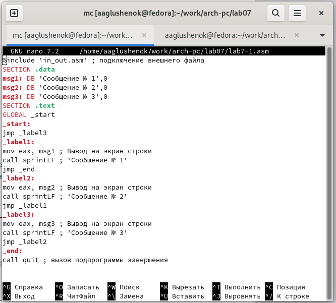{#fig:006 width=80%}

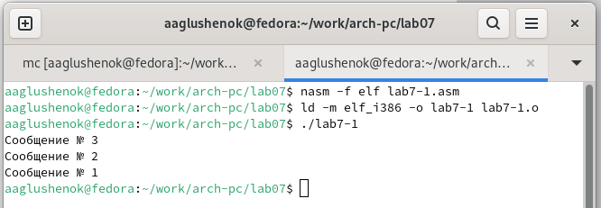{#fig:007 width=80%}

5. Создайте файл lab7-2.asm в каталоге ~/work/arch-pc/lab07. Внимательно изучите текст программы из листинга 7.3 и введите в lab7-2.asm. Создайте исполняемый файл и проверьте его работу для разных значений B.

Вводим в файл lab7-2.asm текст из листинга 7.3. (Программа, которая определяет и выводит на экран наибольшую из 3 переменных: A,B и C). Создаем исполняемый файл и проверяем его работу для разных значений B.

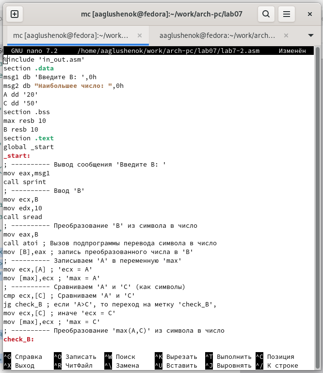{#fig:008 width=80%}

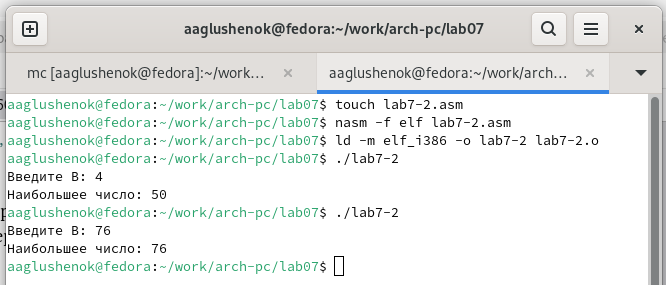{#fig:009 width=80%}

## Задание 2. Изучение структуры файла листинга

6. Создайте файл листинга для программы из файла lab7-2.asm. Откройте файл листинга lab7-2.lst с помощью любого текстового редактора. Внимательно ознакомьтесь с форматом и содержимым листинга. Подробно объясните содержимое трёх строк файла листинга по выбору

Создаем файл листинга для программы из файла lab7-2.asm, указав ключ l и имя файла файла в командной строке. 

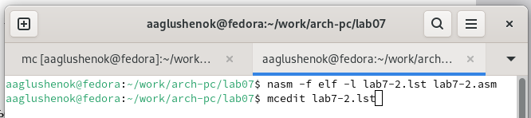{#fig:010 width=80%}

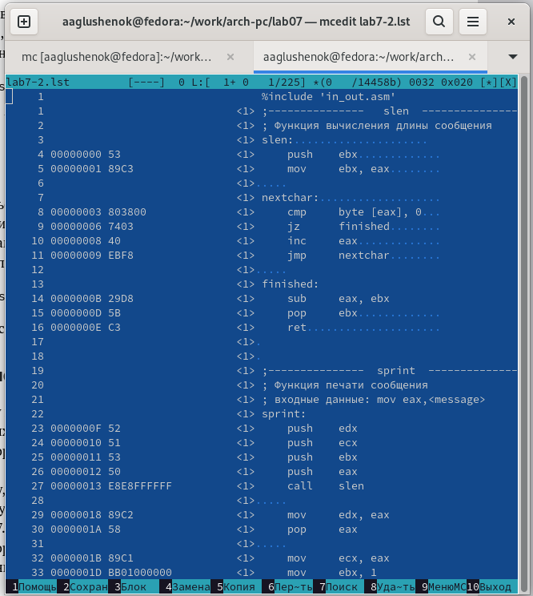{#fig:011 width=80%}

Строка 29: "00000018" - адрес в сегменте кода, "89С2" - машинный код, "mov edx, eax" - копирование значения из регистра aex в регистр edx.

Строка 34: "00000022" - адрес в сегменте кода, "B804000000" -машинный код, "mov eax,4" -присвоение переменной eax значения 4.

7. Откройте файл с программой lab7-2.asm и в любой инструкции с двумя операндами удалите один операнд. Выполните трансляцию с получением файла листинга. Какие выходные файлы создаются в этом случае? 

Открываем файл и удаляем один из операндов. Выполняем трансляцию файла и изучаем файл листинга с ошибкой. При трансляции файла, выдается ошибка, но создаются исполняемые файлы lab7-2 и lab7-2.lst.

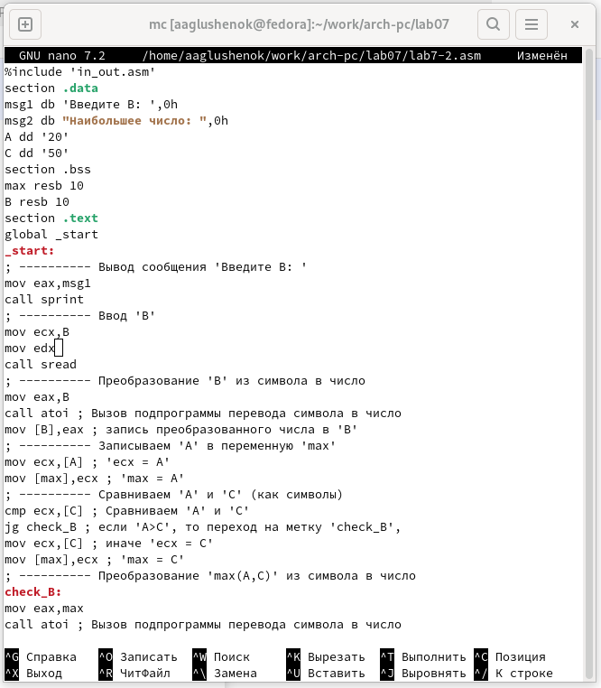{#fig:012 width=80%}

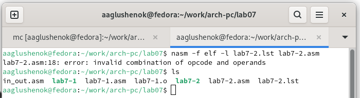{#fig:013 width=80%}

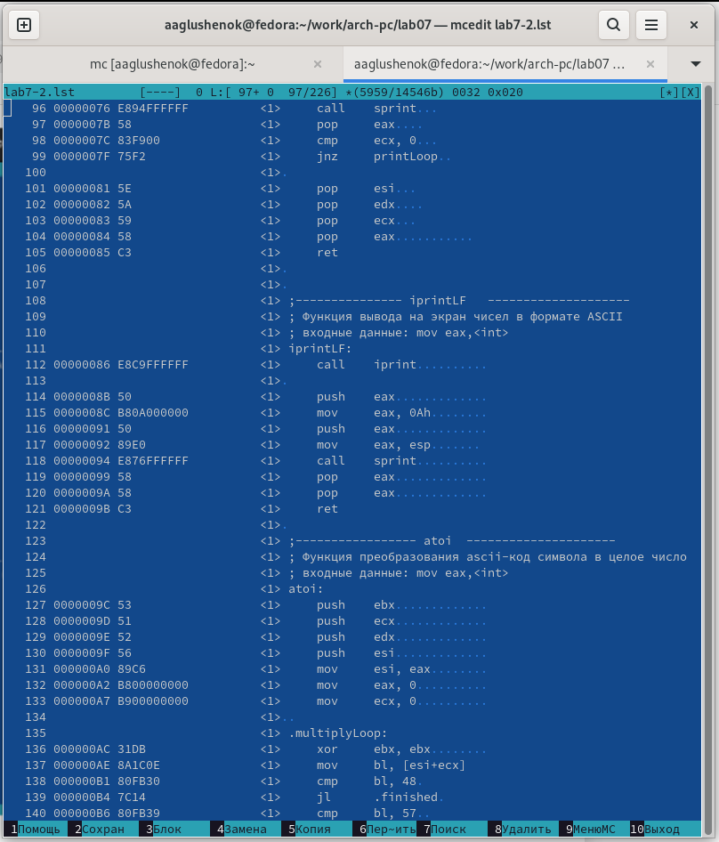{#fig:014 width=80%}

# Задания для самостоятельной работы

1. Напишите программу нахождения наименьшей из 3 целочисленных переменных a, b и c. Значения переменных - 54, 62, 87 (вариант 5). Создайте исполняемый файл и проверьте его работу.

Создаем файл lab7-3.asm, пишем программу, аналогичную предыдущим. Создаем исполняемый файл, проверяем корректность работы программы (ответ 54 - верный).

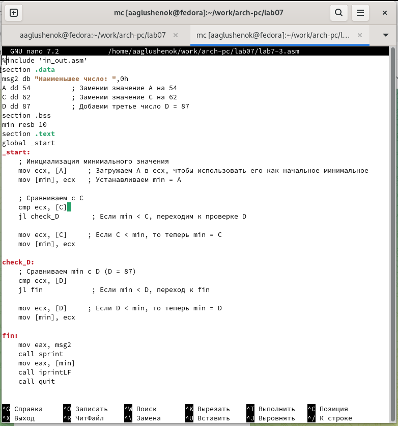{#fig:015 width=80%}

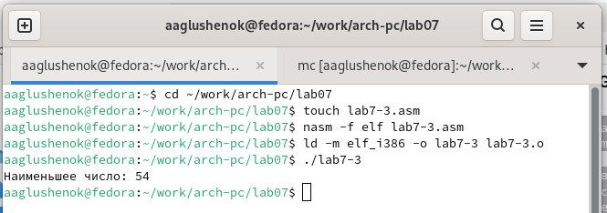{#fig:016 width=80%}

2. Напишите программу, которая для введенных с клавиатуры значений x и a вычисляет значение функции f(x) = 2(x-a), x>a; 15, x<=a; (вариант 5) и выводит результат вычислений. Создайте исполняемый файл и проверьте
его работу для значений x=1, a=2 и x=2, a=1.

Создаем файл lab7-4.asm, пишем программу, аналогичную программам из лабораторных работ 6 и 7. Создаем исполняемый файл, проверяем корректность его работы (ответы 32 и 30 - верные).

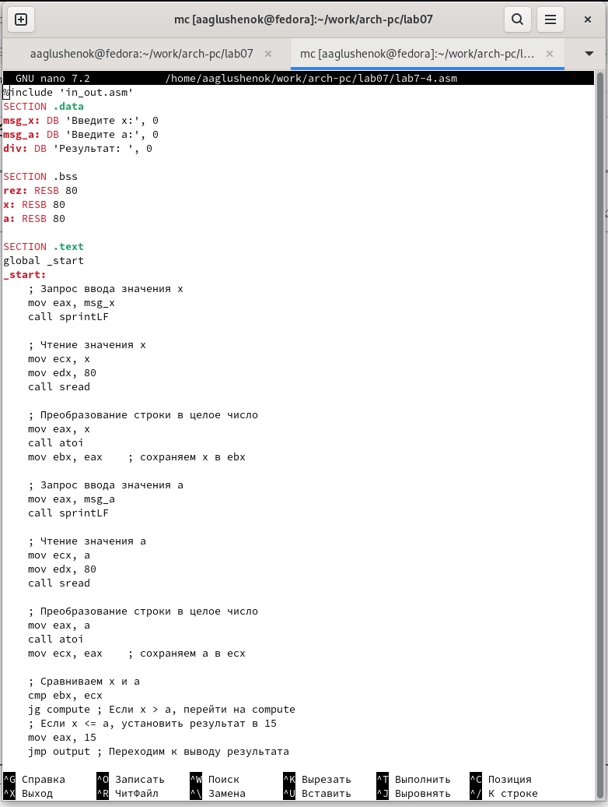{#fig:017 width=80%}

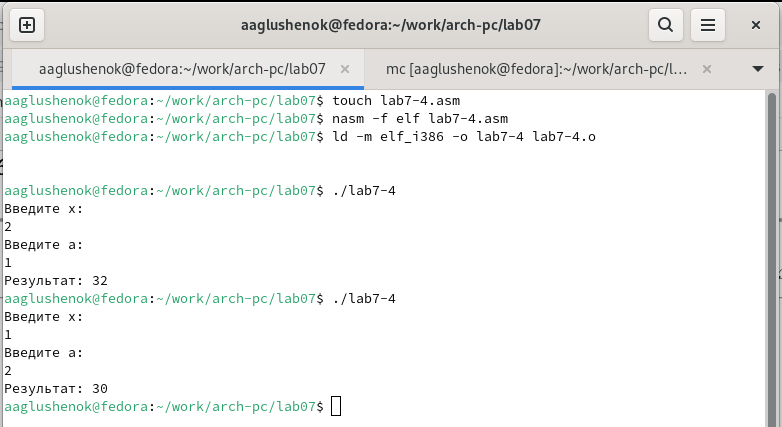{#fig:018 width=80%}

# Выводы

В ходе выполнения лабораторной работы мне удалось изучить команды условного и безусловного переходов, приобрести навыки написания программ с использованием переходов, а так же познакомиться с назначением и структурой файла листинга.
