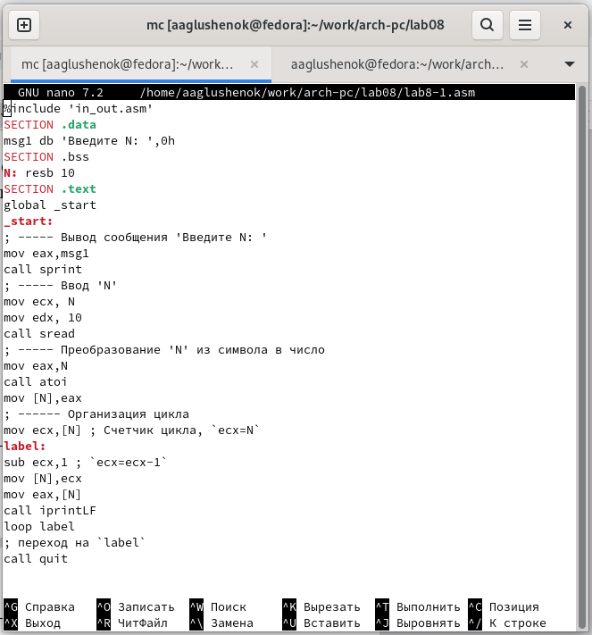

---
## Front matter
title: "Лабораторная работа 8"
subtitle: "Программирование цикла. Обработка аргументов командной строки."
author: "Глушенок Анна Александровна"

## Generic otions
lang: ru-RU
toc-title: "Содержание"

## Bibliography
bibliography: bib/cite.bib
csl: pandoc/csl/gost-r-7-0-5-2008-numeric.csl

## Pdf output format
toc: true # Table of contents
toc-depth: 2
lof: true # List of figures
lot: true # List of tables
fontsize: 12pt
linestretch: 1.5
papersize: a4
documentclass: scrreprt
## I18n polyglossia
polyglossia-lang:
  name: russian
  options:
	- spelling=modern
	- babelshorthands=true
polyglossia-otherlangs:
  name: english
## I18n babel
babel-lang: russian
babel-otherlangs: english
## Fonts
mainfont: IBM Plex Serif
romanfont: IBM Plex Serif
sansfont: IBM Plex Sans
monofont: IBM Plex Mono
mathfont: STIX Two Math
mainfontoptions: Ligatures=Common,Ligatures=TeX,Scale=0.94
romanfontoptions: Ligatures=Common,Ligatures=TeX,Scale=0.94
sansfontoptions: Ligatures=Common,Ligatures=TeX,Scale=MatchLowercase,Scale=0.94
monofontoptions: Scale=MatchLowercase,Scale=0.94,FakeStretch=0.9
mathfontoptions:
## Biblatex
biblatex: true
biblio-style: "gost-numeric"
biblatexoptions:
  - parentracker=true
  - backend=biber
  - hyperref=auto
  - language=auto
  - autolang=other*
  - citestyle=gost-numeric
## Pandoc-crossref LaTeX customization
figureTitle: "Рис."
tableTitle: "Таблица"
listingTitle: "Листинг"
lofTitle: "Список иллюстраций"
lotTitle: "Список таблиц"
lolTitle: "Листинги"
## Misc options
indent: true
header-includes:
  - \usepackage{indentfirst}
  - \usepackage{float} # keep figures where there are in the text
  - \floatplacement{figure}{H} # keep figures where there are in the text
---

# Цель работы

Приобретение навыков написания программ с использованием циклов и обработкой аргументов командной строки

# Выполнение лабораторной работы

## Задание 1. Реализация циклов в NASM

1. Создаем каталог для программам лабораторной работы № 8, переходим в него и создаем файл lab8-1.asm. 

{#fig:001 width=80%}

2. Вводим в файл lab8-1.asm текст программы из листинга 8.1.(Программа вывода значений регистра ecx). Создаем исполняемый файл и проверяем его работу.

{#fig:002 width=80%}

{#fig:003 width=80%}

3. Меняем текст программы, добавив изменение значение регистра ecx в цикле. Создаем исполняемый файл и проверяем его работу. Регистр eax принимает значения 3, 1; число проходов цикла не соответствует значению N.

{#fig:004 width=80%}

{#fig:005 width=80%}

4. Вносим изменения в текст программы, добавив команды push и pop (добавления в стек и извлечения из стека) для сохранения значения счетчика цикла loop. Тогда число проходов цикла становится равным числу N.

{#fig:006 width=80%}

{#fig:007 width=80%}

## Задание 2. Обработка аргументов командной строк

4. Создаем файл lab8-2.asm в каталоге ~/work/arch-pc/lab08 и вводим в него текст программы из листинга 8.2. (Программа выводящая на экран аргументы командной строки). Создаем исполняемый файл и запускаем его, указав аргументы из текста лабораторной работы.

{#fig:008 width=80%}

{#fig:009 width=80%}

5. Создаем файл lab8-3.asm в каталоге ~/work/arch-pc/lab08 и вводим в него текст программы из листинга 8.3. (Программа вычисления суммы аргументов командной строки). Создаем исполняемый файл и запускаем его, указав аргументы.

{#fig:010 width=80%}

{#fig:011 width=80%}

6. Меняем текст программы из листинга 8.3 для вычисления произведения аргументов командной строки.

{#fig:012 width=80%}

{#fig:013 width=80%}

# Задания для самостоятельной работы

1. Создаем программу, которая находит сумму значений функции f(x) от всех введенных пользователем аргументов x. Создаем исполняемый файл и проверяем его работу на нескольких наборах аргументов.

{#fig:014 width=80%}

{#fig:015 width=80%}

# Вывод

В ходе выполнения лабораторной работы мне удалось приобрести навыки написания программ с использованием циклов и обработкой аргументов командной строки

